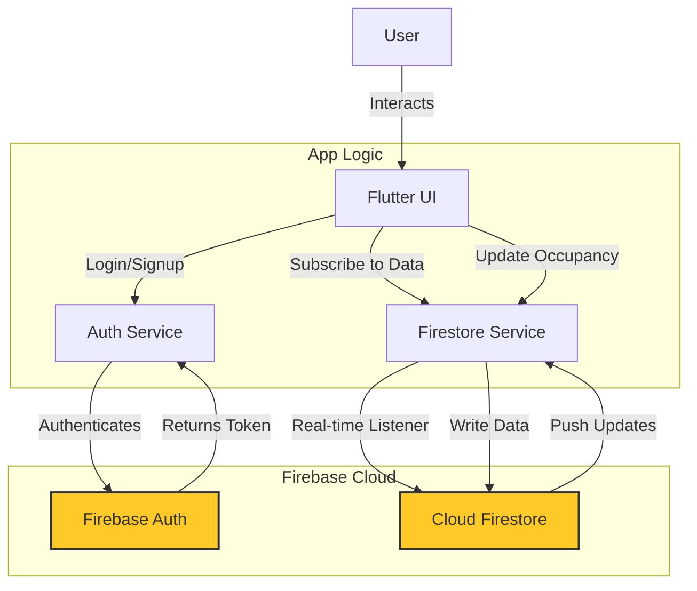

# 🏗️ System Architecture & Data Flow

**Version**: 1.0.0  
**Updated**: 2026-01-22  
**API Docs**: [Postman Collection](docs/flutter_firebase_postman.json)

---

## 🅰️ System Overview

SpaceSync is a cloud-connected mobile application designed to manage and visualize shared community spaces in real-time.

### Tech Stack
*   **Frontend**: Flutter (Dart) - Cross-platform mobile UI.
*   **Authentication**: Firebase Authentication - Secure user identity management.
*   **Database**: Cloud Firestore - NoSQL, real-time database for storing space and occupancy data.
*   **Hosting/Infrastructure**: Google Cloud Platform (managed via Firebase).

---

## 🅱️ Directory Structure

```plaintext
lib/
 ┣ main.dart                # Entry point, App initialization, Routing
 ┣ models/
 ┃ ┗ space.dart             # Data models (Space entity)
 ┣ screens/
 ┃ ┗ login_screen.dart      # User authentication UI
 ┣ services/
 ┃ ┣ auth_service.dart      # Firebase Auth wrapper methods
 ┃ ┣ firestore_service.dart # Cloud Firestore data operations
 ┃ ┗ mock_services.dart     # Fallback services for demo mode
 ┗ space_availability_widget.dart # Main Dashboard & Widgets
```

---

## 🆎 Data Flow Diagram

The following diagram illustrates how data flows between the user, the app, and Firebase services.



1.  **Authentication**: Users sign in via the app. `AuthService` communicates with Firebase Auth to verify credentials and establish a secure session.
2.  **Read Data**: The Dashboard subscribes to a stream of `spaces` from Firestore. Changes in the database are instantly pushed to the app via WebSocket.
3.  **Write Data**: When a user increments occupancy, `FirestoreService` sends a write request to Firestore, which updates the central database and syncs to all other connected clients.

---

## 🆏 Firebase Setup & Integration

### Products Used

1.  **Authentication**
    *   **Methods**: Email/Password, Anonymous.
    *   **Role**: Validates user identity before allowing write access to the database.

2.  **Cloud Firestore (Database)**
    *   **Collection**: `spaces`
    *   **Document Structure**:
        ```json
        {
          "name": "String (e.g., Gym)",
          "maxCapacity": "Number (e.g., 25)",
          "currentOccupancy": "Number (e.g., 5)"
        }
        ```
    *   **Real-time**: Leverages Firestore `snapshots()` to allow multiple devices to stay in sync without manual refreshing.

### Security Rules (Basic)
```javascript
rules_version = '2';
service cloud.firestore {
  match /databases/{database}/documents {
    match /spaces/{space} {
      // Allow read for everyone
      allow read: if true;
      // Allow write only if authenticated
      allow write: if request.auth != null;
    }
  }
}
```

---

## 📧 Deployment & Maintenance

### Build Instructions
*   **Android**: `flutter build apk --release`
*   **iOS**: `flutter build ios --release`
*   **Web**: `flutter build web`

### New Contributor Checklist
1.  Clone the repository.
2.  Install Flutter SDK `3.0+`.
3.  Obtain `google-services.json` (Android) or `GoogleService-Info.plist` (iOS) from the project admin.
4.  Run `flutter pub get`.
5.  If keys are missing, the app will automatically default to **Mock Mode** for development.

---
